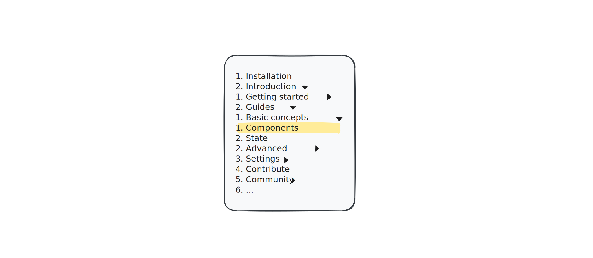

# Homework: Tree

For this homework, you task is to implement a `TOC` component that
renders a hierarchical table of contents, similar to the one found on
React's website.

Here is the list of requirements:

- Each entry in the table of contents has a name (e.g., "Introduction"),
  a slug (e.g., "/content/introduction"), and an optional list of child
  entries. The table of contents supports unlimited levels of child
  entries.

- Entries are rendered as `<a>` elements, with the slug as their `href`.
  If an entry has children, they are rendered inside a `
`
  element.

- Your `TOC` component receives two props:

  - an array of first-level `entries` (e.g., "Installation",
    "Introduction", "Settings", etc.), and

  - `breadcrumbs` for the current page, represented as an array of
    entries (e.g., "Introduction" → "Guides" → "Components").

- The current entry is highlighted and its parent are expanded.

> [!NOTE]
> To determine whether an entry is current or should be expanded, we
> suggest keeping track of its level in the hierarchy. If the entry
> matches the breadcrumb at its level, then it should be highlighted or
> expanded. E.g., the "Guides" entry is expanded because it is at level
> 2, and the second breadcrumb is "Guides".
