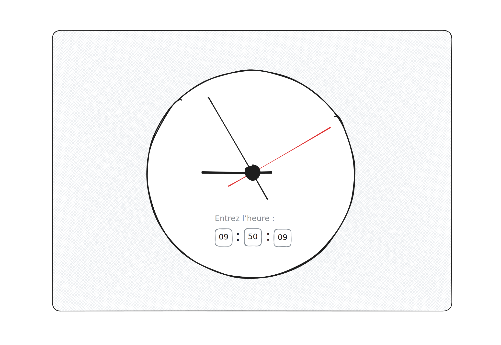

# Homework: State (cont.)

For this homework, your task is to implement a `Clock` component that
includes three `<input>` fields: one for hours, one for minutes, and one
for seconds. As the user changes these fields, the component should
render an analog clock face showing the corresponding time.

We suggest creating a `
` element for each hand (hours, minutes,
seconds), and using the `rotate` CSS function to position them
correctly. The formula to for the angle is `360 / total * time`, where
`total` is 12 for hours and 60 for minutes and seconds. For example, at
12:15, the minute hand is at 90°.
